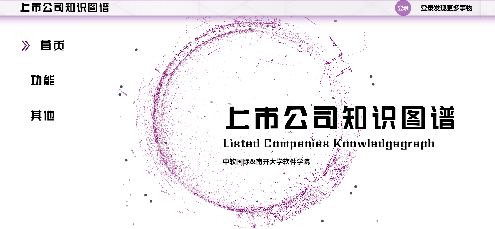

# listedcompanies_knowledgegraph

# 上市公司知识图谱

### 此项目还在制作中🤧

## 主页



### 我们的后端项目仓库

See [后端项目仓库](https://github.com/nkuAlexLee/agriculture_knowledgegraph_django)

### 项目文件结构
./doucments/文件结构.md 请在CODE模式下查看！！！ （此文件并不是最新的🥲）

### 后记

这与上市公司没啥关系的界面设计是因为本来想做关于型月世界观的知识图谱，但是爬取萌娘百科的数据后，用了几种方式都无法很有效的清洗数据（gpt3.5），以及实体之间的关系错漏率太高，加上番剧角色关系在不同季、集可能都不一样，还有一些设定是gpt3.5无法理解的，导致有很多错误，没钱用4.0<del>（我想要钱！！）</del>，所以就放弃了。

但是当时前端界面基本上快做完了，改起来工作量太大就不改了。

于是就变成在二次元界面下去看看上市公司的关系<del>真香</del>

<del><font size="5">在二次元少女的陪伴下尽情去了解上市公司吧</font></del>

## Project setup

```
npm install
```

### Compiles and hot-reloads for development

```
npm run serve
```

### Compiles and minifies for production

```
npm run build
```

### Customize configuration

See [Configuration Reference](https://cli.vuejs.org/config/).
